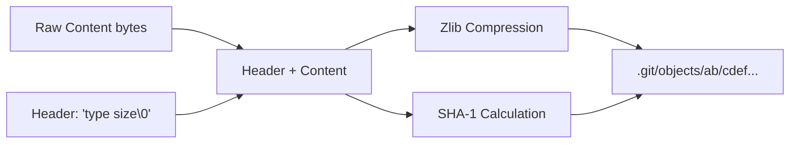
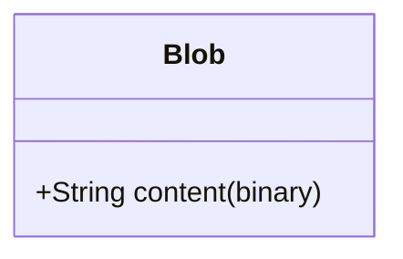
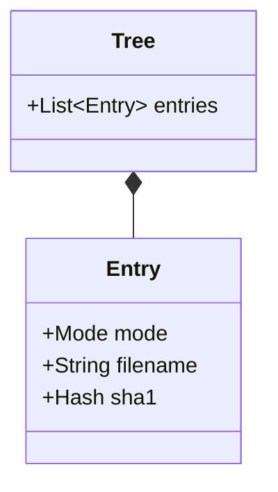
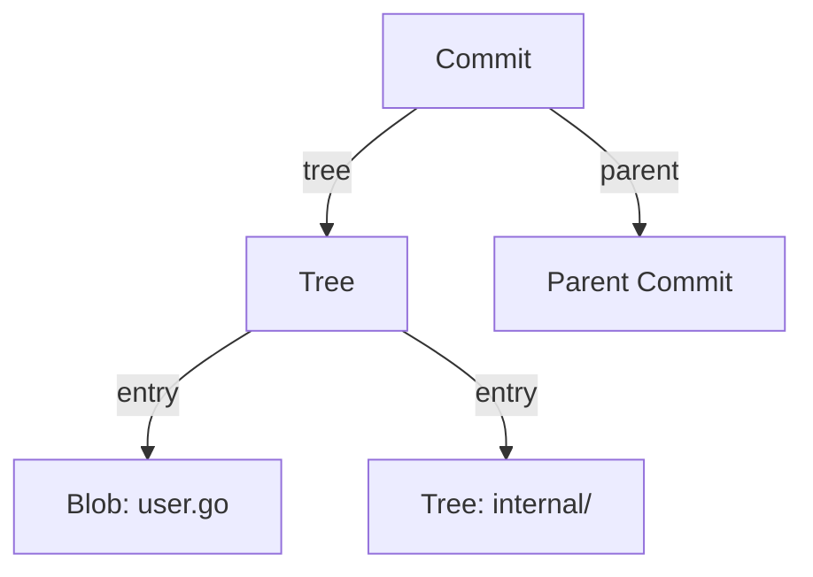
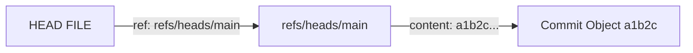

# Git Internals

This document provides a deep dive into the internal structure and mechanisms of
Git. It assumes a technical audience familiar with basic version control
concepts.

## 1. Git Objects

Git is fundamentally a content-addressable filesystem. It stores data as a
key-value pair database, where the key is the hash of the data and the value is
the data itself. These entities are called **Objects**.

There are four primary types of objects in Git: **Blob**, **Tree**, **Commit**,
and **Tag**.

### Object Storage Format (Loose Objects)

Loose objects are stored in the `.git/objects` directory. The storage format for
all loose objects is identical:

1. **Header**: `type <space> size <null-byte>`
    * `type`: The object type (blob, tree, commit, tag).
    * `size`: The size of the uncompressed content in bytes (ASCII).
2. **Content**: The raw binary content of the object.
3. **Compression**: The concatenated header and content are compressed using
   **zlib**.
4. **Hashing**: The SHA-1 hash (160-bit) is computed over the *header +
   uncompressed content*.



### 1.1 Blob (Binary Large Object)

A **Blob** stores file content. It contains no metadata (no filename,
timestamps, or permissions). blobs are opaque byte streams.

* **Format**: `blob <size>\0<content>`



### 1.2 Tree

A **Tree** represents a directory listing. It maps names (filenames) to blobs or
other trees (subdirectories), along with file modes (permissions).

* **Format**: `tree <size>\0<entries>`
* **Entry Format**: `mode <space> path \0 <sha-1 (20 bytes)>`

  * `mode`: e.g., `100644` (file), `40000` (directory/tree), `120000` (symlink).
  * `path`: Filename (relative to the tree).
  * `sha-1`: The 20-byte binary hash of the referenced object.



### 1.3 Commit

A **Commit** represents a snapshot of the project at a specific point in time.
It wraps a root **Tree** object and adds context: author, committer, date,
message, and parent commit(s).

* **Format**: `commit <size>\0<content>`
* **Content**:

    ```text
    tree <tree-hash>
    parent <parent-hash> (repeated for merges, omitted for root commit)
    author <name> <email> <timestamp> <timezone>
    committer <name> <email> <timestamp> <timezone>
    <empty-line>
    <commit message>
    ```



### 1.4 Tag (Annotated)

A **Tag** object provides a permanent, immutable reference to a specific commit
(usually). Annotated tags contain their own message, tagger, and date, distinct
from the commit they point to.

* **Format**: `tag <size>\0<content>`
* **Content**:

    ```text
    object <object-hash>
    type <object-type> (usually commit)
    tag <tag-name>
    tagger <name> <email> <timestamp> <timezone>
    <empty-line>
    <tag-message>
    ```

---

## 2. References (Refs)

While objects are immutable and identified by hash, **References (Refs)** are
mutable, human-readable pointers to objects (typically commits). They are stored
as text files in `.git/refs/` or packed in `.git/packed-refs`.

### 2.1 Heads (Branches)

Stored in `.git/refs/heads/`. A branch is simply a pointer to the tip of a line
of development.

* **Content**: ASCII SHA-1 hash of a Commit object.
* *Example*: `refs/heads/main` -> `a1b2c3...`

### 2.2 Tags (Lightweight vs Annotated)

Stored in `.git/refs/tags/`.

* **Lightweight Tag**: A ref pointing directly to a **Commit** object. Just an
  alias.
* **Annotated Tag**: A ref pointing to a **Tag** object (which in turn points to
  a commit).

### 2.3 Remote References

Stored in `.git/refs/remotes/<remote-name>/`. Represent the state of branches on
remote repositories. These are typically read-only relative to local operations.

### 2.4 Symbolic References (HEAD)

**HEAD** is a special reference that determines the "current checked-out
commit". It usually points to another reference (Symbolic Ref).

* **Content**: `ref: refs/heads/main`
* **Detached HEAD**: HEAD contains a raw SHA-1 hash directly.



---

## 3. Packfiles

To efficiently store and transfer objects, Git uses **Packfiles**. Storing every
version of every file as a loose object is extremely inefficient for storage and
network transfer.

Packfiles (`.pack`) and their indices (`.idx`) are stored in
`.git/objects/pack/`.

### 3.1 Packfile Structure (`.pack`)

A packfile is a single stream containing multiple objects. It uses **Delta
Compression** to store objects as differences against other objects in the same
pack.

**File Format:**

1. **Header**: `PACK` (4 bytes) + Version (4 bytes, typically 2) + Number of
   objects (4 bytes).
2. **Objects**: (Repeated N times)
    * **Metadata**: Type and expanded size (variable length integer).
    * **Data**: zlib compressed stream.
        * *Non-delta*: The full object content.
        * *Ref-delta*: 20-byte base object SHA-1 + compressed delta
          instructions.
        * *Ofs-delta*: Negative offset to base object in same pack + compressed
          delta instructions.
3. **Trailer**: SHA-1 checksum of the entire packfile.


### 3.2 Pack Index (`.idx`)

The index allows Git to quickly locate an object within a `.pack` file without
scanning the entire stream.

**Version 2 IDX Format:**

1. **Magic**: `\377tOc`
2. **Version**: 2
3. **Fanout Table**: 256 x 4-byte integers.
    * Entry `K` stores the count of objects whose SHA-1 starts with byte `K` or
      lower.
    * Allows efficient binary search narrowing.
4. **SHA-1 Table**: Sorted list of all object names (SHA-1s) in the pack.
5. **CRC32 Table**: Checksums for data verification.
6. **Offset Table**: 4-byte offsets into the `.pack` file for each object.
    * If MSB is set, it refers to the 64-bit offset table.
7. **64-bit Offset Table**: (Optional) For packs larger than 2GB.
8. **Pack Checksum**: SHA-1 of the `.pack` file.
9. **Index Checksum**: SHA-1 of the `.idx` file.

### 3.3 Deltas

Git uses a binary delta format (Copy/Insert instructions) to represent changes.

* **Insert**: "Insert literal bytes: 'hello world'"
* **Copy**: "Copy N bytes from offset M in the base object"

Git uses heuristics (window size, type matching, size matching, file extension)
to find the best "base" object for compression.

---

## 4. Hashing Algorithms

### SHA-1

Git traditionally uses **SHA-1** (160-bit) to identify all objects.

* **Construction**: `sha1("type size\0content")`
* **Vulnerability**: SHA-1 is shattered (collision attacks exist). Git has
  implemented **Hardened SHA-1** (detects collision attempts) as a mitigation.

### SHA-256 (The Transition)

Modern Git supports `make sha256` transition.

* **Repository Format v1**: Extensions to support hash algorithm negotiation.
* Objects are identified by 256-bit hashes.
* Interoperability logic exists to map SHA-1 <-> SHA-256 for backward
  compatibility.

---

## 5. Miscellaneous Internals

### 5.1 Configuration

Git configuration is hierarchical:

1. `system`: `/etc/gitconfig`
2. `global`: `~/.gitconfig` or `~/.config/git/config`
3. `local`: `.git/config` (Repository specific)

The format is an INI-style text file.

### 5.2 The Index (Staging Area)

Stored in `.git/index`. It is a binary file containing a sorted list of all file
paths in the current working directory, their permissions, and the SHA-1 of the
blob they currently represent in the staging area. It acts as a cache for the
working tree.

### 5.3 Hooks

Executable scripts in `.git/hooks/`.

* **Client-side**: `pre-commit`, `commit-msg`, `post-merge`.
* **Server-side**: `pre-receive`, `update`, `post-receive`.

### 5.4 Shallow Repositories

Repositories cloned with `--depth`.

* `.git/shallow`: Text file listing commit hashes that are "truncated" (have
  parents that are not present locally). This tells Git "stop traversing history
  here".
